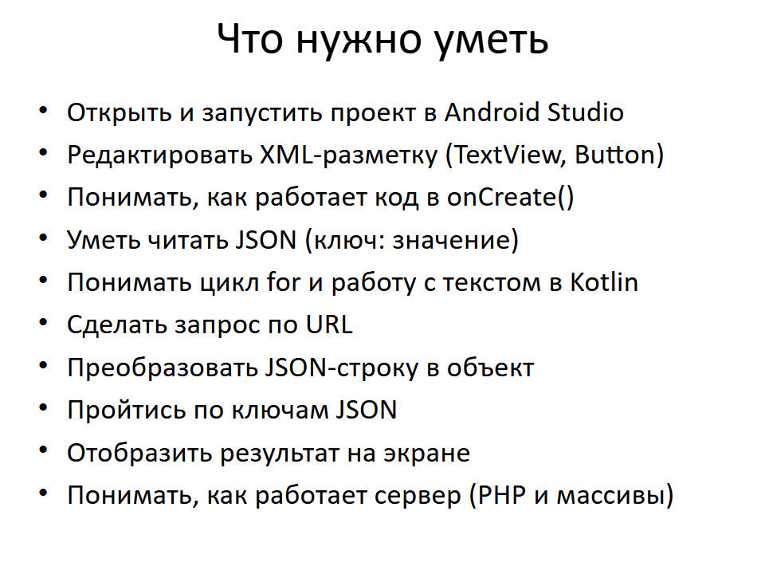
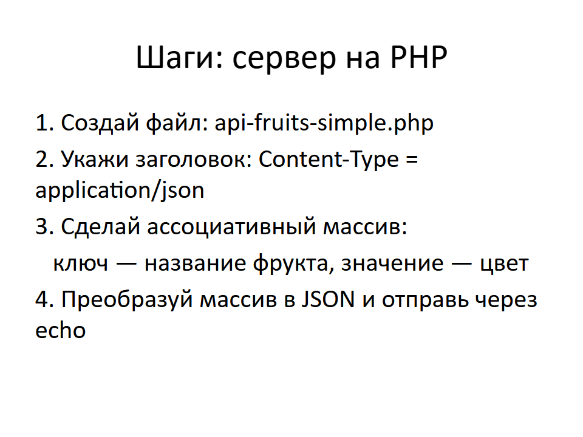
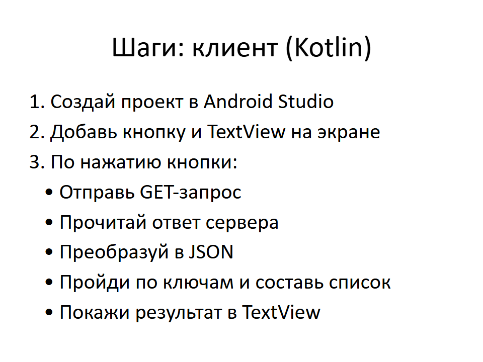
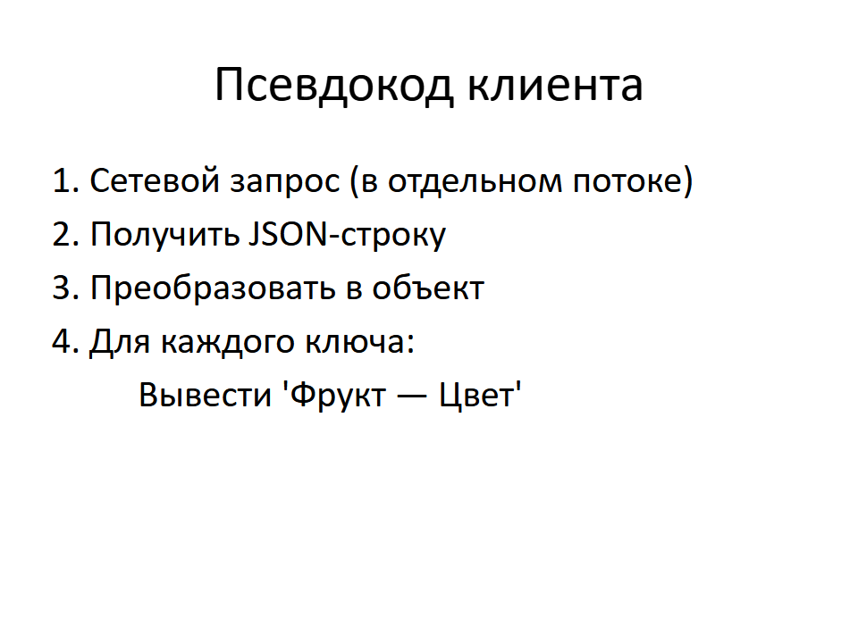

# Простое введение во фронтэнд и бэкэнд

Этот проект помогает понять, как работает простая связка:
- клиент на Android (Kotlin + XML),
- сервер на PHP,
- передача данных в формате JSON.

## Что входит в проект

- `app/` — Android-приложение (кнопка + вывод JSON). Файл MainActivity.kt нужно дополнить свом кодом (простая задача)
- `php/` — PHP-файл, возвращающий JSON, который нужно дополнить свом кодом (простая задача)
- `option for solving the educational task/` — файлы с одним из вариантов решения задач
- `img/` — слайды (в PNG)
- `Проект_Kotlin_PHP_JSON.pptx` — презентация
- `README.md`, `LICENSE.txt`

## Как использовать

1. Клонируй репозиторий: git clone https://github.com/AlexanderProninStudio/SItFaB.git
2. Дополни PHP-файл и помести его на внешний или локальный сервер (XAMPP, OpenServer).
3. Дополни файл MainActivity.kt
4. Запусти приложение и убедись, что работает вывод JSON.
5. Используй слайды и/или файлы с одним из вариантов решения задач (для подсказок).

### Визуальные подсказки (слайды)

## Сервер

Пример сервера реализован на PHP и доступен по адресу:

https://helper.alexpronin.ru/api-fruits-simple.php

Если вы запускаете приложение в эмуляторе и хотите обратиться к локальному серверу на хост-машине, то 127.0.0.1 в эмуляторе указывает на сам эмулятор, а не на ваш компьютер. В этом случае используйте IP-адрес 10.0.2.2 — это специальный адрес, который эмулятор перенаправляет на хост-машину.

Использование HTTP (незащищённого трафика) небезопасно — данные могут быть перехвачены или изменены злоумышленниками. Рекомендуется использовать HTTPS, если это возможно.
(При использовании только HTTPS, рекомендую удалить android:usesCleartextTraffic="true" из файла AndroidManifest.xml)

## Лицензия

Проект распространяется по лицензии MIT. См. файл [LICENSE](LICENSE) для подробностей.

> Обратите внимание: только оригинальный текст лицензии на английском языке имеет юридическую силу. Русские переводы можно найти на официальных сайтах, однако они предоставляются исключительно для ознакомления.

---

Проект разработан Александром Прониным в образовательных целях, для использования на занятиях по мобильной разработке.

